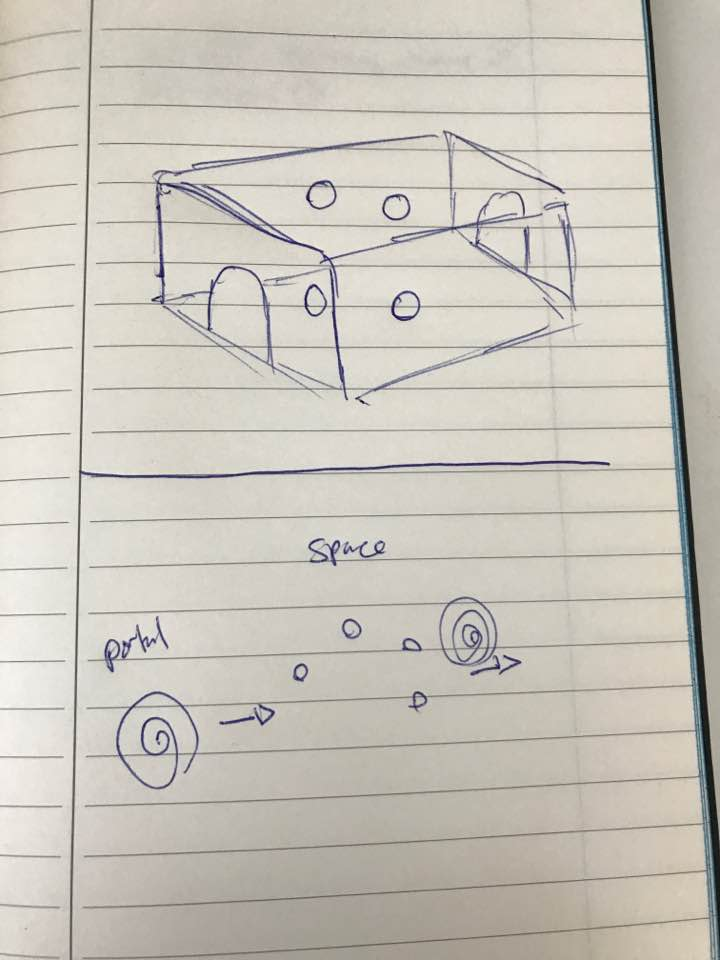

# Super Puzzler
## VR Puzzle Game

### Summary
This project was created for the Udacity VR Design traning. This repo is geared for documenting the process
That I took to create, test, and iterate on the project. The final product is a puzzle game where the players
can go into a dungeon and will be greeted with orbs that play a sequence of sounds. These sounds then need to be clicked
backed in the same sequence. If the player is successful then the player will be exited out of the game.

[link text](https://www.youtube.com/watch?v=havos3ysGOE "Final Project Video")

### Persona
The persona I focused on for this project was a user who was either new to VR or had a few experiences with it. I also wanted to find a age group that was slightly older
as the theme and mood of the game was a little gloomy. The persona I decided on is as follows

NAME: Anabell
AGE: 25
VR Experience: Low to Medium

Based on my user test, my assumption for choosing a older person seem correct.

### Sketches

Inital sketch of the design for the game

Inital sketch of the GUI for the game

Based on my user test, I had to add a few subtitles and warnings to tell that the user will move when the start button is hit.

User Testing Notes:
Name: Chimi Kim
Experience in VR: Low

Question 1: Tell me about the room size.
Answer 1: The room looks scary, but well lit. The Size of the room seems good, but I feel a little shorter than I normally am.

Question 2: Tell me about the objects you see.
Answer 2: Most of the items are interesting. The barrels are cute, but the little ones look very small. I also noticed the orbs right away. Not sure what they do but they are cool. 

Question 3: Is there anything wierd you notice about the room.
Answer 3: Not really. I don't see anything through the doors. So I actually don't know which way is front or back.

Question 4: If there is one thing you would want to change or add what would it be?
Answer 4: I would change the color of the blue light to pink or purple. 

Analysis of User Test:

The user seems to be interested in the vr experience, however, this is her 2nd vr experience so the bar is pretty low.
One interesting thing is that the user is able to detect their own height very clearly and commented on that difference based on the
room size. The orbs was another interesting thing that user pointed out. Because of the spot light it was obvious that something needed
to be done with it, but at this point of the game they are not really interative so the suer was confused.

User Testing GUI Notes:
Name: Andrew Keturi
Experience in VR: Medium

Question 1: Do you see any canvas? 
Yes, I see a black canvas. It looks like a welcome message and a start gui

Question 2: How do you think you can interacte with the screen?
I like how the pointer is green and when I interacte with what looks like the button, it highlights in a light green color. Very similar to
how websites would work. If I click on it it would probably start the game

Question 3: Tell me about the canvas, is there anything you would change about them?
Hmm the I don't really like the black canvas. It's very bland. It is also a little big and I wish I can see part of the game behind it.

Question 4: Click on the start button, and tell me about the new canvas.
The new canavs looks like it's there to restart the game. Pretty straight foward.

User Testing Movement Notes:
Name: Chimi Kim
Experience in VR: Low

Question 1: Click on the start button and tell me how you feel?
I movement was a little jarring because I didn't expect myself to move foward

Question 2: How is the speed. Too fast or too low?
The speed was a little fast but not too bad

Question 3: Are you feeling any discomfort?
I only felt a little discomfort in the begining when I didn't know what was going to happen. 
It would be nice if the game told me I was about to move foward when I did something.

Question 4: would you change anything about the experience?
Not much, just what I mentioned about the speed and a little heads up on when I'm going to move.